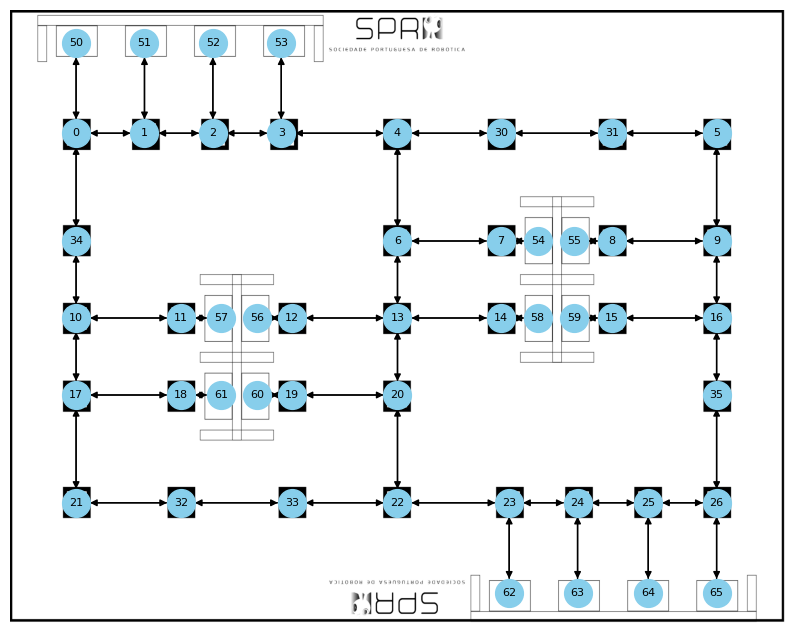

# MPC-BSpline


This repository provides a Python-based simulator designed to implement Model Predictive Control (MPC) for B-Spline trajectory tracking. The simulator is built to handle trajectory tracking for an omnidirectional robot, offering a flexible and efficient way to test and tune control parameters.

## Installation

 Clone this repository:
   ```bash
   git clone https://github.com/C2SR/MPC-BSpline.git
   cd MPC-BSpline
   pip install -r requirements.txt
   ```

  ## Usage
   
 Use the `trajectory_generator.py` script to create B-Spline trajectories. This script accepts various command-line arguments to configure path generation parameters:
 ```bash

 trajectory_generator.py [-h] [--map MAP] [--k K] [--Lambda LAMBDA] [--vmax VMAX] [--vmin VMIN] [--delta DELTA] [--path PATH] [--f F] [--file FILE] [--folder FOLDER]
```
#### Available Arguments

| Argument       | Description                                      |
|----------------|--------------------------------------------------|
| `-h`, `--help` | Show the help message and exit.                  |
| `--map`        | Path to the map YAML file.                       |
| `--k`          | B-Spline order.                                  |
| `--Lambda`     | Corner detection hyperparameter for B-Spline.    |
| `--vmax`       | Maximum speed for the robot.                     |
| `--vmin`       | Minimum speed for the robot.                     |
| `--delta`      | Acceleration parameter for the robot.            |
| `--path`       | B-Spline control points for the trajectory.      |
| `--f`          | Control cycle frequency.                         |
| `--file`       | Name of the output file.                         |
| `--folder`     | Directory where the output file will be saved.   |

To use the trajectory specified in the associated paper, run the script with default values. The script generates trajectories in both `.npy` and `.yaml` formats—`.npy` for this repository and `.yaml` for use with ROS.

The figure below illustrates the control point IDs used in the B-Spline path:



Other maps may be used, provided they are represented as bidirectional graphs with nodes and edges stored in a YAML file.

###  Running the MPC Simulator

To start the MPC simulator, execute:

```bash
python3 main.py --cfg config_omni.yaml
```


This configuration file includes:

- **Simulation Parameters**: Defines the simulation length, control step size, and physical dimensions.
- **Motor Parameters**: Configures motor characteristics, including gain, time constant, and control limits. The motor is implemented as a first order system.
- **MPC Parameters**: Specifies MPC tuning variables such as the prediction horizon (`N`) and weighting matrices (`Q` and `R`).


## Dependencies

This project requires Python 3.x and additional libraries listed in `requirements.txt`.

## License

This project is licensed under the MIT License. See the [LICENSE](LICENSE) file for details.